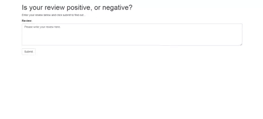

# Sentiment Analysis (SageMaker Deployment Project)

The notebook and Python files provided here, once completed, result in a simple web app which interacts with a deployed recurrent neural network performing sentiment analysis on movie reviews. 

Please see the [README](https://github.com/udacity/sagemaker-deployment/tree/master/README.md) for instructions on setting up a SageMaker notebook and downloading the project files.

